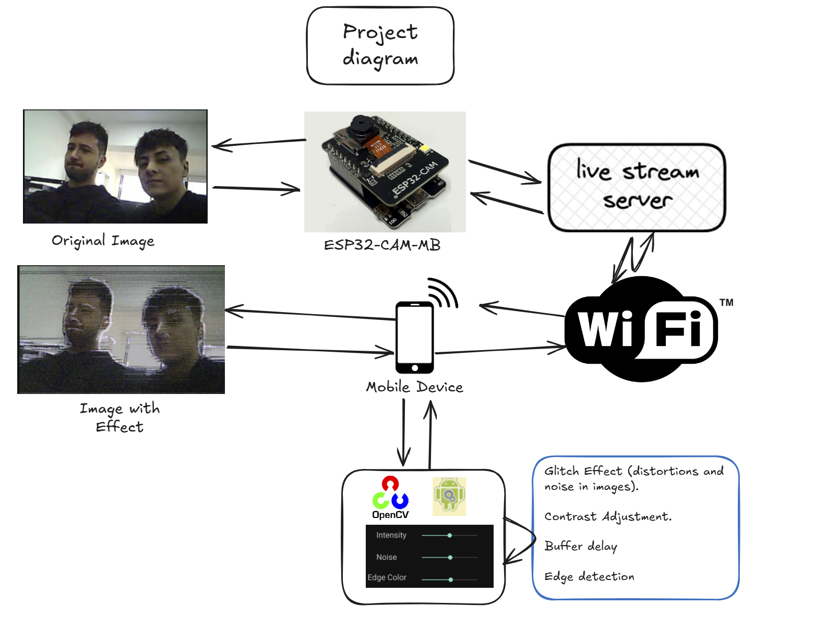

# AppVision

## Realizado por Jairo Salazar y Samuel Pardo

La siguiente aplicación utiliza la placa ESP32-CAM-MB, que integra la cámara OV2640, como dispositivo
de captura de vídeo. Esta placa será configurada para desplegar un servidor de streaming de vídeo,
permitiendo que la aplicación móvil reciba las imágenes capturadas de la cámara en tiempo real a
través de una conexión WiFi. En la aplicación móvil, se realizará un preprocesamiento de las imágenes,
utilizando técnicas como la binarización, umbralización, detección de bordes, manipulación de píxeles,
y la aplicación de filtros para generar efectos visuales en tiempo real.

El objetivo de este proyecto es implementar un sistema eficiente para la captura, procesamiento y
visualización de imágenes, teniendo en cuenta las limitaciones de hardware de la placa ESP32-CAM-MB
y la aplicación móvil. Además, se evaluar´a el rendimiento del sistema, midiendo parámetros como la
tasa de fotogramas por segundo (FPS), el uso de memoria RAM y el ancho de banda necesario para la
transmisión de datos, lo que permitirá analizar la viabilidad de este enfoque para aplicaciones en tiempo
real.

## Arquitectura

## Aplicación

## Rendimiento

